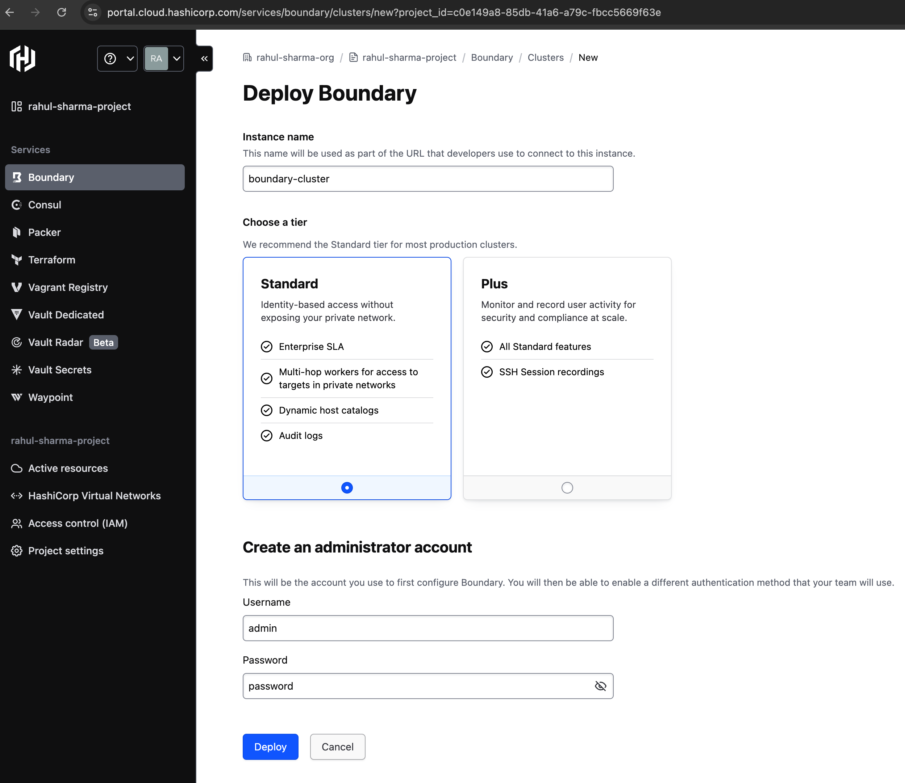
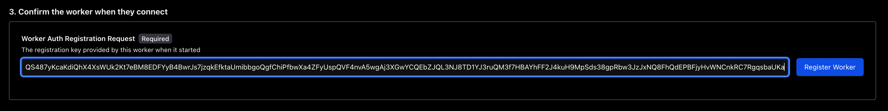
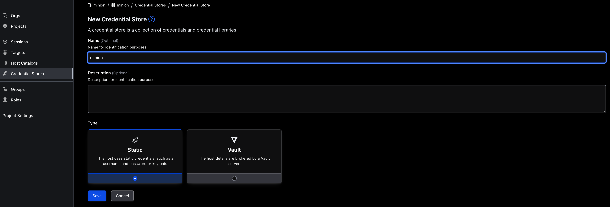
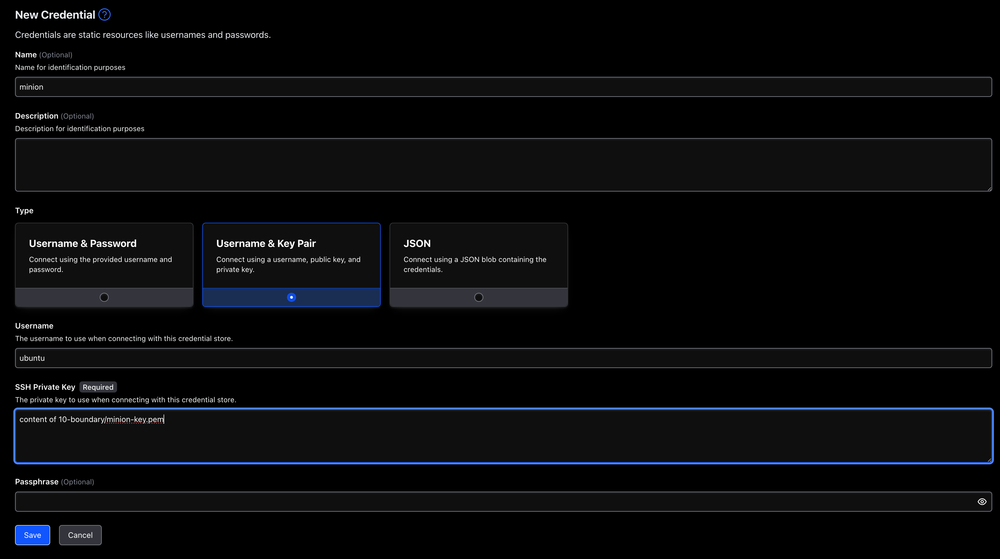
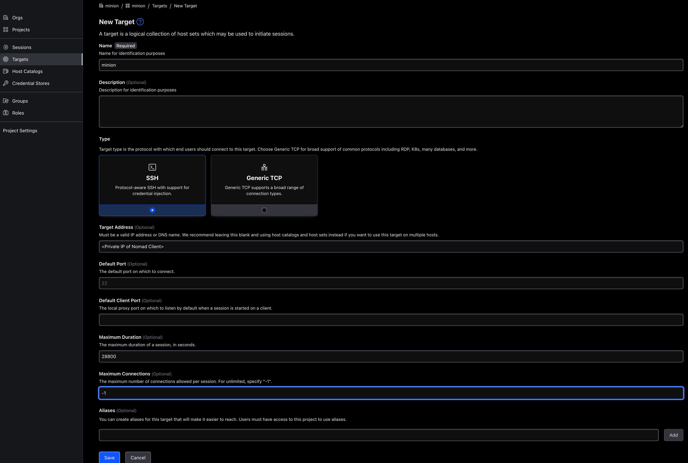
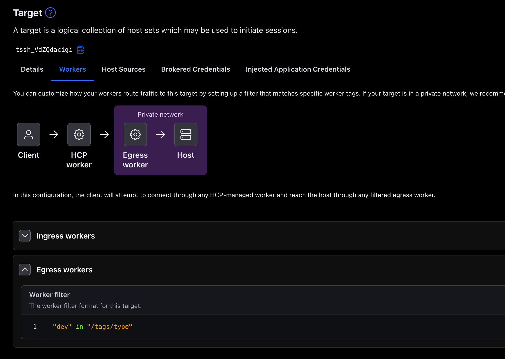

# Part 10: Boundary Integration

## Background
Our Hello app is already running with Consul, Nomad and Vault.
**Limitations**
- **Security Risk** The Response Service is hosted on pusblic aws_instances. This poses security risk.

## Goal
- Response Service can be hosted on private client to achieve enhanced security. This bring another problem, like how on-calls are going to access and debug these services. Boundary helps in this regards.

## Overview
This part introduces Boundary to access the private Nomad nodes

## Prerequisites
1. **Tools Installed**:
   - Terraform CLI
   - jq CLI
   - Packer CLI
2. **Packer generated AMI** (Pre-baked AMI with Consul Server, Consul Client, Docker Images, DNS Configuration):
   - An AWS account with access keys configured.

## Steps to Run

1. **Login to your HCP cluster and deploy a Boundary Cluster**
   

2. **Spinning the Infra**
   Copy the cluster ID and provide it in `variables.hcl`

   Run
   ```bash
   terraform init
   terraform apply -var-file=variables.hcl
   ```

   Response
   ```
   Outputs:

   instance_ids = <<EOT
      i-0b20bf3c812b56de2,
      i-019e110dbfc52325e

   EOT
   private_ip = <<EOT
      # Nomad server
      172.31.31.136,

      # Nomad client
      172.31.16.254,
      172.31.21.180

   EOT
   ssh_server = "ssh -i minion-key.pem ubuntu@34.224.58.251"
   ui_urls = <<EOT
      Consul: http://34.224.58.251:8500
      Nomad: http://34.224.58.251:4646
      Boundary: http://34.224.58.251:9200

   EOT
   ```
3. **Deploying Reasonse Service**
   Once Nomad ui is up, apply the job present in `10-boundary/nomad-jobs/response-service.nomad`. Wait till, the two instances are health and running.

4. **SSH to the server node**
   SSH and open the below mentioned file to retrieve the `Worker Auth Registration Request`
   ```bash
   vi boundary_output.log
   ```

   Copy the code suggested by below key:
   ```
   Worker Auth Registration Request: <code-to-copy>
   ```

5. **Adding worker**
   Open the AdminUI of Boundary Cluster from HCP portal. Click `Workers`->`Add new Worker` and then paste the code copied from last step in UI as shown in below screenshot.
   

   You shall see the New worked added.

6. **Create Target**
   Open the AdminUI of newly created cluster and create new `org` and `project` with name `minion`

   Click the `Credential Store` tab on the left.
   Create a new credential by filling the form as shown below.
   

   Click save and then click `Credentails` tab and then click `New`.
   Fill the form as show in below screenshot.
   


   Click `Targets` and `New Target`.

   Fill the form as shown below.
   


   Select `Workers` tab and click egress and add `"dev" in "/tags/type"` as filter text.
   

   Now select the tab `Injected Application Credentials` and click `Add Injected Application Credentials` and the select the credentials and `Add Injected Application Credentials`


7. **Boundary SSH session**
   Install boundary locally and run below command

   ```bash
   export BOUNDARY_ADDR="https://<cluster-id>.boundary.hashicorp.cloud" 
   boundary authenticate password -login-name=admin
   <enter password interactively>

   boundary connect ssh -target-id <copy-target-id>

   # at this point, we are expected to be one of the nomad client.
   curl --request PUT --data '["Bello!", "Poopaye!", "Tulaliloo ti amo!"]' http://consul.service.consul:8500/v1/kv/minion_phrases
   curl response-service.service.consul:6060/response | jq 
   ```

   Expected respponse:
   ```json
   {
   "message": "Hello from HelloService!",
   "minion_phrases": [
      "Bello!",
      "Poopaye!",
      "Tulaliloo ti amo!"
   ],
   "response_message": "Bello from ResponseService i-05506b6e36d25223a!"
   }
   ```


## Key Points
- Application management Platform like Nomad helps to easily deploy the application, scale it, provides better resource optimization, better control over scalibility.
